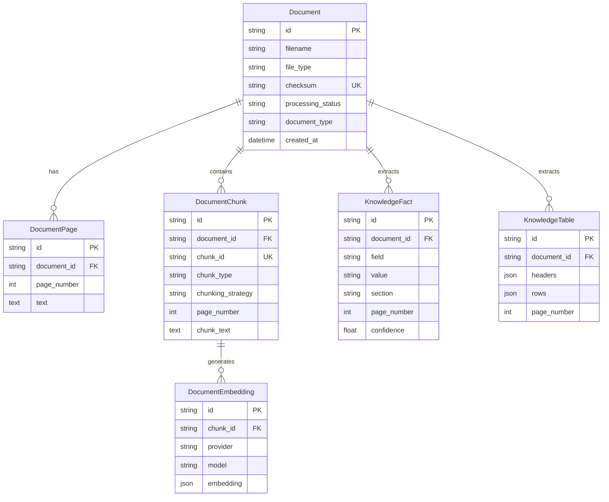

# System Architecture

The **Cost-Aware Knowledge Engine** is architected to optimize the tradeoff between retrieval accuracy, response latency, and inference cost. Instead of blindly sending high-volume document contexts to expensive Large Language Models (LLMs), the platform implements an **enterprise tiered retrieval engine** with deterministic entity extraction, hybrid vector-lexical indexing, and real-time cost telemetry.

---

## High-Level System Architecture

```mermaid
graph TB
    subgraph ClientLayer ["Client Layer (React 19 + Vite)"]
        UI_Nav["Navbar & Health Monitor"]
        UI_Doc["Document Hub (Ingestion & Cascaded Deletion)"]
        UI_Query["Query Studio (Tiered Routing & Evidence)"]
        UI_Cost["Cost Telemetry Dashboard"]
        UI_Search["Search Lab (Hybrid Retrieval Inspector)"]
    end

    subgraph APILayer ["FastAPI REST Gateway"]
        R_Doc["/documents Routes"]
        R_Query["/queries Routes (/search, /answer)"]
        R_Metrics["/metrics Routes (/costs, /overview)"]
        CORS["CORS Middleware & Exception Handlers"]
    end

    subgraph ServiceLayer ["Core Service Orchestration"]
        Cache["Query Normalizer & In-Memory Cache (Tier 0)"]
        Router["Query Analyzer & Cost Router"]
        Extractor["Deterministic Answer Extractor (Tier 1)"]
        HybridRetriever["Hybrid Retriever (BM25 + Cosine Similarity) (Tier 2)"]
        LLMFallback["OpenRouter LLM Provider (Tier 3 Fallback)"]
        CostTracker["Cost & Token Accounting Engine"]
        Indexer["Knowledge Indexer & Chunking Engine"]
    end

    subgraph StorageLayer ["Persistence & Vector Layer"]
        DB[(PostgreSQL / SQLite)]
        T_Doc["documents"]
        T_Page["document_pages"]
        T_Chunk["document_chunks (Sliding & Semantic)"]
        T_Fact["knowledge_facts (Key-Value)"]
        T_Table["knowledge_tables (Structured)"]
        T_Embed["embeddings (pgvector / deterministic JSON)"]
    end

    ClientLayer --> APILayer
    APILayer --> ServiceLayer
    ServiceLayer --> StorageLayer
```



---

## Architecture Components

### 1. Client Layer (`frontend/`)

Built with **React 19**, **Vite**, **Lucide React**, and a custom-crafted CSS design system based on dark-mode glassmorphic aesthetics and enterprise typography (**Plus Jakarta Sans** and **JetBrains Mono**).

- **Navigation & Health Monitor ([`Navbar.jsx`](file:///c:/Users/91876/cost-aware-knowledge-engine/frontend/src/components/Navbar.jsx)):** Real-time service connectivity status, live cache size indicators, and instant module switching.
- **Document Hub ([`DocumentHub.jsx`](file:///c:/Users/91876/cost-aware-knowledge-engine/frontend/src/components/DocumentHub.jsx)):** Multi-file drag-and-drop uploader supporting PDF, TXT, and receipts. Includes page-level viewer, chunk inspection modal, and atomic cascaded deletion.
- **Query Studio ([`QueryStudio.jsx`](file:///c:/Users/91876/cost-aware-knowledge-engine/frontend/src/components/QueryStudio.jsx)):** Interactive query interface with query suggestions, routing tier indicators (`cache`, `deterministic`, `lexical`, `semantic`, `llm_fallback`), confidence meters, and exact quote citations.
- **Cost Telemetry Dashboard ([`CostDashboard.jsx`](file:///c:/Users/91876/cost-aware-knowledge-engine/frontend/src/components/CostDashboard.jsx)):** Micro-dollar expenditure tracking, cumulative LLM cost savings versus an always-LLM baseline, query latency monitoring, and token economics breakdown.
- **Search Lab ([`SearchLab.jsx`](file:///c:/Users/91876/cost-aware-knowledge-engine/frontend/src/components/SearchLab.jsx)):** Deep inspector for raw hybrid retrieval scoring, chunk strategy analysis (sliding window vs. semantic), and similarity thresholds.

---

### 2. API Gateway (`backend/app/api/`)

The backend is built with **FastAPI** and uses modular, dependency-injected routers:

- **[`documents.py`](file:///c:/Users/91876/cost-aware-knowledge-engine/backend/app/api/routes/documents.py):**
  - `POST /documents/upload`: Multipart upload with checksum computation, deduplication check, and background or inline indexing.
  - `GET /documents`: Aggregated document listing with page, chunk, fact, and table counters.
  - `GET /documents/{id}`: Detailed inspection of extracted pages, chunks, and structured facts.
  - `DELETE /documents/{id}`: Atomic cascaded deletion across all child records and parent metadata.
- **[`queries.py`](file:///c:/Users/91876/cost-aware-knowledge-engine/backend/app/api/routes/queries.py):**
  - `GET /queries/search`: Hybrid search across facts, lexical chunks, and vector embeddings.
  - `POST /queries/answer`: Multi-tier answering pipeline executing normalization, caching, routing, deterministic extraction, fallback LLM generation, and cost accounting.
- **[`metrics.py`](file:///c:/Users/91876/cost-aware-knowledge-engine/backend/app/api/routes/metrics.py):**
  - `GET /metrics/costs`: Telemetry records, aggregated spends, and baseline savings percentages.
  - `POST /metrics/costs/reset`: Clears runtime telemetry records.
  - `GET /metrics/overview`: System-wide database entity counts, active cache entries, and total query counts.

---

### 3. Retrieval & Routing Engine (`backend/app/services/`)

The core intelligence relies on a **4-tier progressive resolution strategy**:

```
Tier 0: Query Normalizer & Memory Cache   [$0.000000 | < 2ms]
        │
        ├── Miss ──► Tier 1: Deterministic Fact Extractor [$0.000000 | < 15ms]
                     │
                     ├── Low Confidence ──► Tier 2: Hybrid Retrieval (Lexical + Vector) [$0.000001 | < 40ms]
                                            │
                                            └── Low Confidence & LLM Allowed ──► Tier 3: Constrained LLM Fallback [~$0.002000 | ~600ms]
```

1. **Tier 0 (Cache):** Query strings are normalized (case folding, punctuation trimming, whitespace collapsing) and checked against an in-memory LRU cache.
2. **Tier 1 (Deterministic Extraction):** The [`AnswerExtractor`](file:///c:/Users/91876/cost-aware-knowledge-engine/backend/app/services/answering/answer_extractor.py) queries structured key-value entities in the `knowledge_facts` table (e.g., invoice numbers, dates, monetary totals, customer names). If an exact match is found with high confidence (>= 0.8), the answer is returned with zero LLM inference cost.
3. **Tier 2 (Hybrid Retrieval):** Searches both structured facts, full-text chunks (BM25 lexical scoring), and vector embeddings (cosine similarity). Results are deduplicated and reranked using calibrated score normalization.
4. **Tier 3 (Constrained LLM Fallback):** When deterministic extraction fails or confidence is below threshold (< 0.3), the system constructs a minimal context window from the top retrieved chunks and invokes an OpenRouter-hosted LLM (e.g., `google/gemini-2.5-flash` or `openai/gpt-4o-mini`).

---

### 4. Database Schema & Data Models

The relational database is orchestrated through **SQLAlchemy** and supports both **PostgreSQL with pgvector** (production) and **SQLite** (local development and tests).



#### Idempotency & Stability Guarantees
- **Documents:** Checksummed using SHA-256 of the extracted page text. Uploading an identical document triggers deduplication.
- **Chunks:** Assigned deterministic IDs derived from `document_checksum + chunking_strategy + page_number + index + text_hash`.
- **Embeddings:** Unique constraint on `(chunk_id, provider, model)` prevents redundant vector calculations.
- **Cascaded Integrity:** Explicit foreign-key cascaded cleanup guarantees that deleting a document purges all child pages, chunks, facts, tables, and embeddings without leaving orphaned records.

---

### 5. Cost Tracking Subsystem (`backend/app/services/cost_tracker.py`)

Every query processed by the engine is tracked by the in-memory singleton [`CostTracker`]:

- **Tracked Metrics:**
  - `retrieval_cost`: Flat amortized database/compute cost per query (default: `$0.000001`).
  - `llm_cost`: Exact token-based cost charged when Tier 3 fallback is triggered.
  - `prompt_tokens` & `completion_tokens`: Token volumes logged per LLM call.
  - `duration_ms`: End-to-end roundtrip latency.
  - `method`: Resolution tier (`cache`, `deterministic`, `semantic`, `llm_fallback`).
- **Baseline Savings Formula:**
  $$\text{Baseline Potential Cost} = \text{Total Queries} \times \$0.002000$$
  $$\text{Actual Cost} = \sum (\text{Retrieval Cost} + \text{LLM Cost})$$
  $$\text{Estimated Savings} = \max(0, \text{Baseline Potential Cost} - \text{Actual Cost})$$
