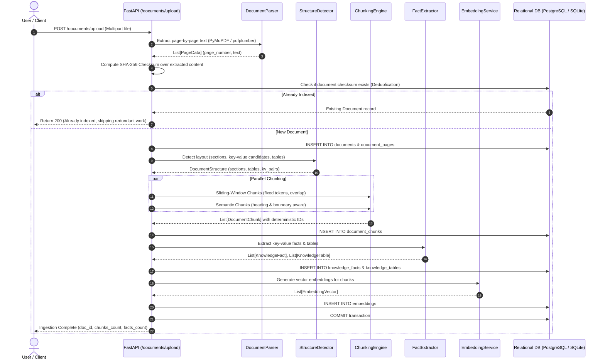
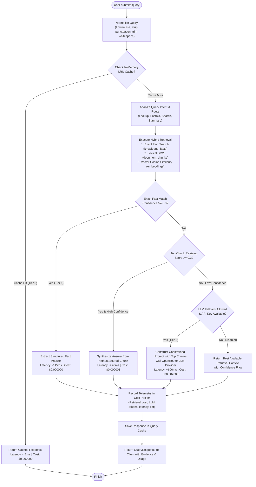
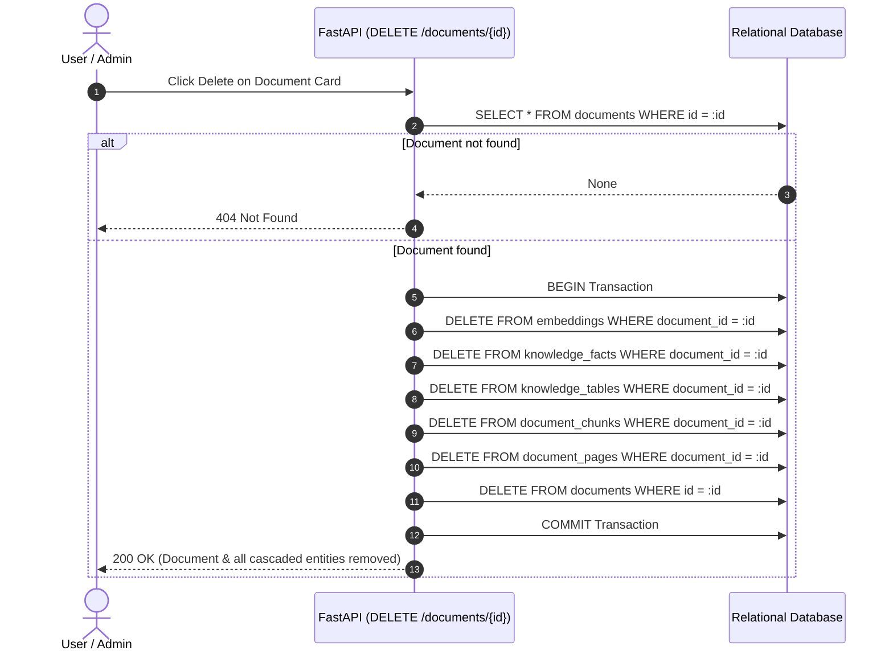

# Execution & Data Flows

This document details the step-by-step execution pipelines, sequence diagrams, and decision trees powering the **Cost-Aware Knowledge Engine**.

---

## 1. Document Ingestion & Knowledge Indexing Flow

When a user uploads a document (PDF, TXT, or scan receipt) through the **Document Hub**, it undergoes a deterministic multi-stage parsing and indexing pipeline:

### Key Stages in Ingestion:
1. **Extraction & Sanitization:** Text is extracted per page. If the file is a PDF, [`PyMuPDF`](https://pymupdf.readthedocs.io/) extracts layout blocks and textual streams.
2. **Deterministic Checksumming:** A cryptographic SHA-256 hash is generated from normalized page text to provide idempotent deduplication.
3. **Dual Chunking Strategy:**
   - **Sliding-Window Chunks:** Configurable window size (e.g., 200 words, 40-word overlap) ensures continuity across sentence boundaries.
   - **Semantic Chunks:** Chunk boundaries respect document headers, paragraphs, and logical sections.
4. **Structured Knowledge Extraction:** Key-value pairs (e.g., `Receipt Number: LR-00501`, `Total: $450.00`, `Date: 2026-08-15`) are extracted with confidence scores and persisted into `knowledge_facts`.
5. **Deterministic Chunk Hashing:** Each chunk is assigned a stable unique key derived from:
   $$\text{chunk\_id} = \text{hash}(\text{doc\_checksum} + \text{strategy} + \text{page} + \text{index} + \text{text})$$

---

## 2. Query Resolution & Multi-Tier Routing Flow

Every query submitted to the `/queries/answer` endpoint traverses an intelligent multi-tiered decision tree designed to minimize latency and eliminate unnecessary LLM inference costs:

---

## 3. Tier Comparison Matrix

| Tier | Name | Trigger Condition | Average Latency | Estimated Cost | Accuracy Profile |
| :--- | :--- | :--- | :--- | :--- | :--- |
| **Tier 0** | **Normalized Cache** | Identical normalized query previously answered | `< 2 ms` | **$0.000000** | $100\%$ deterministic |
| **Tier 1** | **Structured Fact Extractor** | Exact field match in `knowledge_facts` with confidence $\ge 0.8$ | `< 15 ms` | **$0.000000** | Exact grounded extraction |
| **Tier 2** | **Hybrid Lexical & Semantic** | BM25 match or vector cosine similarity chunk score $\ge 0.3$ | `< 40 ms` | **$0.000001** | High recall, zero hallucinations |
| **Tier 3** | **Constrained LLM Fallback** | Extraction confidence $< 0.3$ and `llm_allowed = true` | `~600 ms` | **~$0.002000** | Generative synthesis from top chunks |

---

## 4. Cascaded Document Deletion Flow

Deleting a document in the **Document Hub** triggers an atomic transaction across all relational tiers to ensure clean garbage collection without orphaned vectors:

---

## 5. Cost Tracking & Observability Data Flow

The cost telemetry engine records every query event in real time:

1. **Query Event Ingestion:** Captures query text, resolution tier, prompt tokens, completion tokens, LLM API expenditure, and retrieval baseline cost.
2. **Cumulative Aggregation:** In-memory counters calculate running totals for queries, tokens, and micro-dollar expenditures.
3. **Counterfactual Savings Estimation:** Evaluates total cost against an enterprise baseline where every query is routed to a full LLM call:
   $$\text{Savings} = (\text{Total Queries} \times \$0.002000) - \text{Actual Engine Spend}$$
4. **Client Polling & Live Sync:** The frontend **Cost Dashboard** queries `GET /metrics/costs` to render live spending curves, savings gauges, and query distribution charts.
